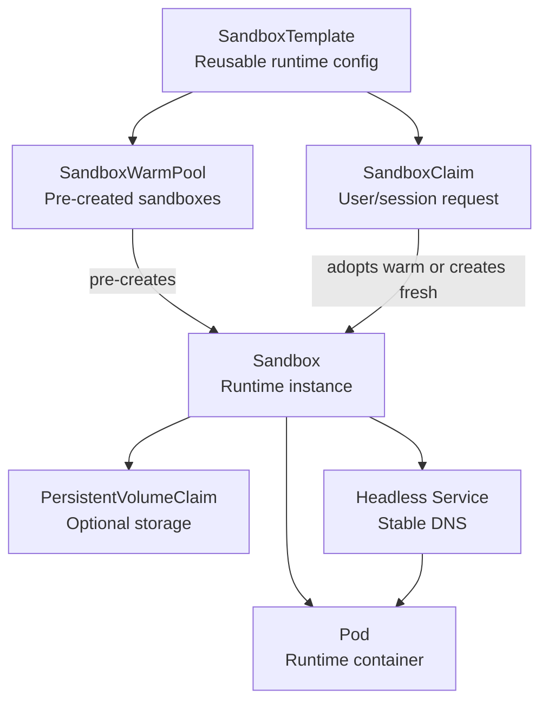

# Mini Sandbox Controller

Mini Sandbox Controller is a learning-sized Kubernetes controller that rebuilds the core ideas behind an agent sandbox platform.

It starts with a simple `Sandbox` custom resource and grows into a small version of a full sandbox architecture:

```text
SandboxTemplate
  -> SandboxWarmPool
  -> SandboxClaim
  -> Sandbox
  -> PVC + Pod + Headless Service
```

The project is intentionally compact. It exists to make Kubernetes controller patterns concrete: custom resources, reconciliation, owner references, status updates, lifecycle, persistence, templates, claims, and warm-pool adoption.

## Description

This controller lets users model isolated runtime environments as Kubernetes custom resources. A `Sandbox` creates the low-level Kubernetes resources needed for one runtime: an optional PVC, a Pod, and a headless Service. A `SandboxTemplate` defines reusable runtime configuration. A `SandboxClaim` requests one sandbox from a template. A `SandboxWarmPool` pre-creates ready sandboxes from a template so claims can adopt them quickly instead of waiting for a fresh Pod to start.

This is not intended to be a production sandbox platform. It is a clean educational implementation that mirrors the architecture of larger systems such as agent sandbox controllers.

## Architecture



## Custom Resources

### Sandbox

A `Sandbox` is the core runtime object.

```yaml
apiVersion: demo.example.com/v1alpha1
kind: Sandbox
metadata:
  name: sandbox-sample
spec:
  image: nginx
  replicas: 1
  storage:
    size: 1Gi
    mountPath: /data
```

The controller creates:

```text
PVC/sandbox-sample-data
Pod/sandbox-sample
Service/sandbox-sample
```

The Service is headless, so the sandbox has stable DNS while still pointing directly at the backing Pod endpoint:

```text
sandbox-sample.default.svc.cluster.local
```

### SandboxTemplate

A `SandboxTemplate` defines reusable runtime configuration.

```yaml
apiVersion: demo.example.com/v1alpha1
kind: SandboxTemplate
metadata:
  name: python-template
spec:
  image: nginx
  storage:
    size: 1Gi
    mountPath: /data
```

### SandboxClaim

A `SandboxClaim` asks for one sandbox from a template.

```yaml
apiVersion: demo.example.com/v1alpha1
kind: SandboxClaim
metadata:
  name: claim-sample
spec:
  templateRef:
    name: python-template
```

The claim controller:

```text
1. Reads the referenced SandboxTemplate.
2. Looks for an available warm Sandbox for that template.
3. Adopts the warm Sandbox if one is ready.
4. Otherwise creates a fresh Sandbox from the template.
5. Mirrors the Sandbox phase into SandboxClaim.status.
```

### SandboxWarmPool

A `SandboxWarmPool` pre-creates ready sandboxes for a template.

```yaml
apiVersion: demo.example.com/v1alpha1
kind: SandboxWarmPool
metadata:
  name: python-pool
spec:
  replicas: 2
  templateRef:
    name: python-template
```

Warm pool Sandboxes are labeled with their pool and template:

```text
demo.example.com/template=python-template
demo.example.com/warm-pool=python-pool
```

Those labels let the claim controller find matching warm sandboxes.

## Reconciliation Behavior

### Sandbox Controller

```text
spec.replicas omitted or 1
  -> ensure PVC exists if storage is configured
  -> ensure Pod exists
  -> ensure headless Service exists
  -> update status from Pod phase

spec.replicas: 0
  -> delete Pod
  -> keep Service and PVC
  -> status.phase = Stopped

spec.shutdownTime reached
  -> delete Pod
  -> keep Service and PVC
  -> status.phase = Expired
```

### SandboxClaim Controller

```text
If claim already tracks a Sandbox in status:
  -> fetch that Sandbox
  -> mirror status

Else if a matching warm Sandbox is available:
  -> change owner from SandboxWarmPool to SandboxClaim
  -> set claim status to adopted Sandbox name

Else:
  -> create fresh Sandbox from SandboxTemplate
```

### SandboxWarmPool Controller

```text
List Sandboxes owned by this WarmPool.
Create missing Sandboxes until spec.replicas is reached.
Delete extra Sandboxes when spec.replicas is reduced.
Count Running Sandboxes as readyReplicas.
```

## Why Owner References Matter

Owner references connect parent resources to child resources:

```text
Sandbox owns Pod, PVC, and Service.
SandboxClaim owns claimed Sandboxes.
SandboxWarmPool owns available warm Sandboxes.
```

This gives two important controller behaviors:

1. Kubernetes can garbage-collect child resources when an owner is deleted.
2. controller-runtime can map child resource changes back to the owning parent.

For example:

```go
ctrl.NewControllerManagedBy(mgr).
    For(&demov1alpha1.Sandbox{}).
    Owns(&corev1.Pod{}).
    Owns(&corev1.Service{})
```

This means Pod or Service changes enqueue reconciliation for the owning `Sandbox`.

## Getting Started

### Prerequisites
- Go
- Docker, Colima, or another local container runtime
- kubectl
- kind, k3d, Docker Desktop Kubernetes, or another Kubernetes cluster
- Kubebuilder/controller-gen tooling installed through the project Makefile

### Fast Local Loop

Install CRDs into the current cluster:

```sh
make install
```

Run the controller locally:

```sh
make run
```

In another terminal, apply sample resources:

```sh
kubectl apply -f config/samples/demo_v1alpha1_sandboxtemplate.yaml
kubectl apply -f config/samples/demo_v1alpha1_sandboxwarmpool.yaml
kubectl apply -f config/samples/demo_v1alpha1_sandboxclaim.yaml
```

Inspect:

```sh
kubectl get sandboxtemplates
kubectl get sandboxclaims
kubectl get sandboxwarmpools
kubectl get sandboxes
kubectl get pods,pvc,svc
```

### Deploy Controller Into The Cluster

Build and push a controller image:

```sh
make docker-build docker-push IMG=<some-registry>/mini-sandbox-controller:tag
```

Deploy the manager:

```sh
make deploy IMG=<some-registry>/mini-sandbox-controller:tag
```

For learning and local iteration, `make run` is usually faster than building and deploying the manager image.

## Smoke Tests

### Direct Sandbox

```sh
kubectl apply -f config/samples/demo_v1alpha1_sandbox.yaml
kubectl get sandbox sandbox-sample -o yaml
kubectl get pod sandbox-sample
kubectl get pvc sandbox-sample-data
kubectl get svc sandbox-sample
```

Expected:

```text
Pod is Running
PVC is Bound
Service has ClusterIP None
Sandbox status has phase, serviceName, and serviceDNS
```

### Replicas 0/1

Stop the runtime:

```sh
kubectl patch sandbox sandbox-sample --type merge -p '{"spec":{"replicas":0}}'
kubectl get pods
kubectl get sandbox sandbox-sample -o yaml
```

Expected:

```text
Pod is deleted
status.phase = Stopped
```

Start it again:

```sh
kubectl patch sandbox sandbox-sample --type merge -p '{"spec":{"replicas":1}}'
kubectl get pod sandbox-sample
```

### Lifecycle Expiry

Set shutdown time two minutes in the future on macOS:

```sh
SHUTDOWN_TIME="$(date -u -v+2M +"%Y-%m-%dT%H:%M:%SZ")"
kubectl patch sandbox sandbox-sample --type merge -p "{\"spec\":{\"shutdownTime\":\"${SHUTDOWN_TIME}\"}}"
```

Watch:

```sh
kubectl get pods -w
```

Expected after shutdown time:

```text
Pod is deleted
status.phase = Expired
```

### Warm Pool Adoption

Create a template and pool:

```sh
kubectl apply -f config/samples/demo_v1alpha1_sandboxtemplate.yaml
kubectl apply -f config/samples/demo_v1alpha1_sandboxwarmpool.yaml
```

Wait for warm Sandboxes:

```sh
kubectl get sandboxes --show-labels
kubectl get pods
```

Apply an adoption claim:

```sh
kubectl apply -f config/samples/adopted_claim.yaml
```

Check claim status:

```sh
kubectl get sandboxclaim adopted-claim -o yaml
```

Expected:

```yaml
status:
  sandboxName: python-pool-0
  phase: Running
```

The exact adopted sandbox name may differ. The important thing is that the claim points at a warm-pool Sandbox rather than creating `Sandbox/adopted-claim`.

### To Uninstall
**Delete the instances (CRs) from the cluster:**

```sh
kubectl delete -k config/samples/
```

**Delete the APIs(CRDs) from the cluster:**

```sh
make uninstall
```

**UnDeploy the controller from the cluster:**

```sh
make undeploy
```

## Project Distribution

This project is primarily a learning project, but it still uses standard Kubebuilder packaging paths.

### By providing a bundle with all YAML files

1. Build the installer for the image built and published in the registry:

```sh
make build-installer IMG=<some-registry>/mini-sandbox-controller:tag
```

**NOTE:** The makefile target mentioned above generates an 'install.yaml'
file in the dist directory. This file contains all the resources built
with Kustomize, which are necessary to install this project without its
dependencies.

2. Using the installer

Users can just run 'kubectl apply -f <URL for YAML BUNDLE>' to install
the project, i.e.:

```sh
kubectl apply -f https://raw.githubusercontent.com/<org>/mini-sandbox-controller/<tag or branch>/dist/install.yaml
```

### By providing a Helm Chart

1. Build the chart using the optional helm plugin

```sh
kubebuilder edit --plugins=helm/v2-alpha
```

2. See that a chart was generated under 'dist/chart', and users
can obtain this solution from there.

**NOTE:** If you change the project, you need to update the Helm Chart
using the same command above to sync the latest changes. Furthermore,
if you create webhooks, you need to use the above command with
the '--force' flag and manually ensure that any custom configuration
previously added to 'dist/chart/values.yaml' or 'dist/chart/manager/manager.yaml'
is manually re-applied afterwards.

## Contributing

This repository is meant to be easy to learn from. Good contributions include:

- improving controller readability
- adding focused tests
- tightening reconciliation edge cases
- improving sample YAMLs
- documenting architecture and workflows
- adding safer status conditions
- improving warm-pool adoption behavior

Before opening a change, run:

```sh
make generate
make manifests
go test ./api/...
go test ./internal/controller -run '^$'
```

Some generated Kubebuilder tests require local envtest binaries. The compile-only command above is useful when those binaries are not installed.

**NOTE:** Run `make help` for more information on all potential `make` targets

More information can be found via the [Kubebuilder Documentation](https://book.kubebuilder.io/introduction.html)

## How This Maps To Agent Sandbox

This mini project mirrors the core shape of a larger agent sandbox system:

| Mini Project | Larger Sandbox Concept |
| --- | --- |
| `Sandbox` | Stateful singleton runtime abstraction |
| Pod | Actual agent/runtime process |
| PVC | Persistent workspace/storage |
| Headless Service | Stable network identity |
| `replicas: 0/1` | Stop/start lifecycle control |
| `shutdownTime` | Expiry/lifecycle policy |
| `SandboxTemplate` | Reusable approved runtime definition |
| `SandboxClaim` | User/app request for a sandbox |
| `SandboxWarmPool` | Fast startup through pre-created runtimes |

Larger systems add production concerns such as generated clients, SDKs, routers, gateways, network policies, tracing, metrics, security hardening, and e2e tests. This project keeps the core architecture small enough to understand end to end.

## Useful Commands

```sh
# Regenerate deepcopy code
make generate

# Regenerate CRDs/RBAC
make manifests

# Install CRDs into current cluster
make install

# Run controller locally
make run

# Compile-check controller package without envtest specs
go test ./internal/controller -run '^$'

# Run pure helper tests
go test ./internal/controller -run 'Test(DesiredReplicas|SandboxExpired|NextWarmSandboxName)'
```

## Current Limitations

- No SDK/client yet.
- No admission webhooks.
- No production-grade conditions.
- Template updates do not roll existing Sandboxes.
- Warm-pool adoption is intentionally simple.
- Full envtest controller tests require local envtest binaries.

## License

Copyright 2026.

Licensed under the Apache License, Version 2.0 (the "License");
you may not use this file except in compliance with the License.
You may obtain a copy of the License at

    http://www.apache.org/licenses/LICENSE-2.0

Unless required by applicable law or agreed to in writing, software
distributed under the License is distributed on an "AS IS" BASIS,
WITHOUT WARRANTIES OR CONDITIONS OF ANY KIND, either express or implied.
See the License for the specific language governing permissions and
limitations under the License.
